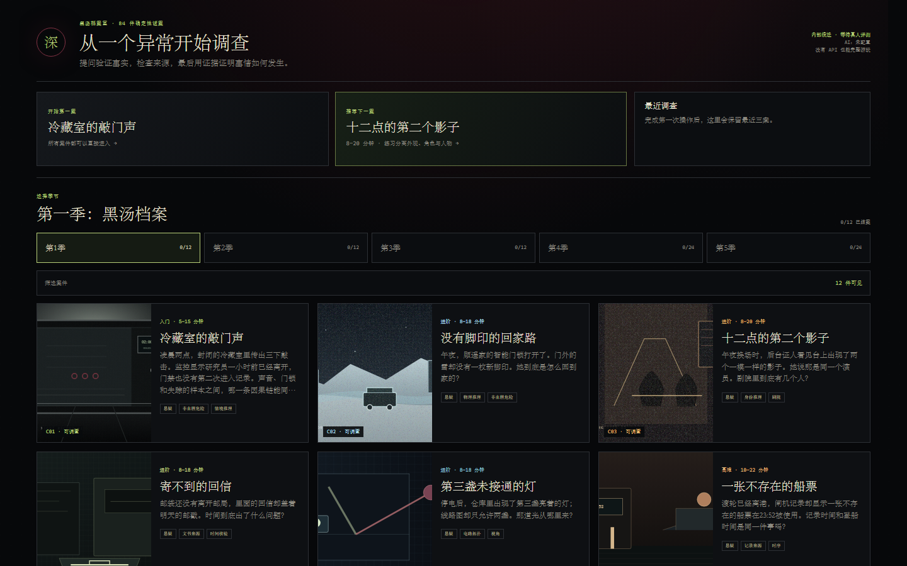
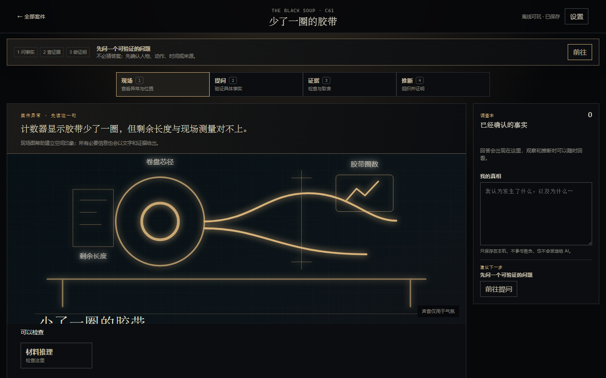
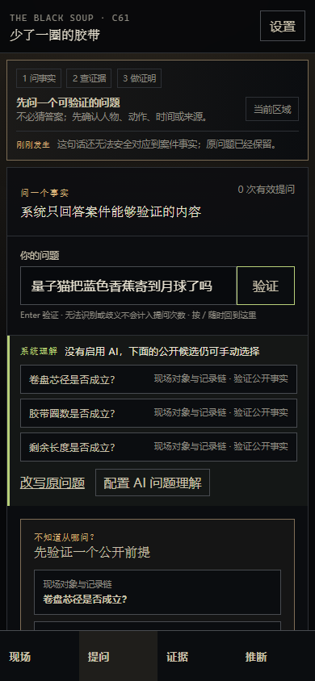
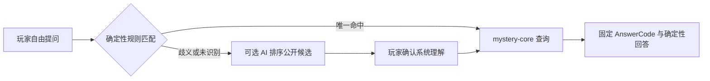

<h1 align="center">THE BLACK SOUP · 深汤</h1>

<p align="center"><strong>你不只是猜中真相——你必须把它证明出来。</strong></p>

<p align="center">
  一款中文、离线优先的确定性海龟汤调查游戏。<br />
  自由提问，检查证据，组织推断，最后用完整的因果链结案。
</p>

<p align="center"><em>A deterministic, offline-first mystery game where guessing the truth is only the beginning—you must prove it.</em></p>

<p align="center">
  
  
  
  
  
  <a href="./LICENSE"></a>
</p>

<p align="center">
  <a href="https://github.com/wangyufanshuai/turtle-soup/raw/refs/heads/main/dist/turtle-soup-v2.11-internal-rc-web-pwa.zip"><strong>一键下载 v2.11 离线版</strong></a>
  ·
  <a href="#-3-分钟本地运行">本地运行</a>
  ·
  <a href="./docs/v2.11-internal-rc.md">验证报告</a>
</p>



> [!IMPORTANT]
> v2.11 是 `internal-rc / human-evaluation-pending`：工程门禁已通过，但正式真人 Fun Gate 仍为 **0 人**。本项目不把自动化结果宣称为“已证明好玩”或市场验证。

## 海龟汤不该只剩“是 / 不是”

传统海龟汤的魅力在于通过问题逼近那个不可能的真相；它的难题是，理解问题和判定答案通常都依赖一位知道真相的主持人。

《深汤》把这个过程做成了可单人、可离线、可重放的调查系统：

- **问可验证的事实**：系统先告诉你“它把问题理解成了什么”，再给出确定性回答。
- **用证据缩小可能性**：证据不是收集品，而是用来支撑或排除因果链的约束。
- **把猜想变成证明**：猜到关键词不算结案；你需要组织事件、关系和最小证据集。
- **可以犯错，也可以回头**：歧义与未识别问题不消耗次数，提交失败会告诉你还缺哪类证明。

| | 普通海龟汤 | 《深汤》 |
|---|---|---|
| 谁来判定 | 主持人根据真相即时判断 | 确定性规则与 `AnswerCode` |
| 怎样算赢 | 猜中大意 | 提交可验证的完整证明 |
| 如何游玩 | 通常需要一位知道答案的人 | 单人、离线、可存档 |
| 语言歧义 | 依赖主持人发挥 | 显示理解、玩家确认、低置信度安全关闭 |
| AI 的角色 | 可能直接做裁判 | 只可选帮你和系统“对齐问法”，不知道真相 |

## 🔎 30 秒看懂玩法

1. **现场**：读谜面，观察空间、物件和异常。
2. **提问**：输入一个可验证的问题，确认系统理解的对象与关系。
3. **证据**：检查新出现的记录、痕迹或物件，决定加入证明还是暂时搁置。
4. **推断**：把事件放进时间线、身份矩阵、空间图或因果图，然后提交你的解释。

<table>
  <tr>
    <td width="68%"></td>
    <td width="32%"></td>
  </tr>
  <tr>
    <td align="center">桌面：一个主工作区 + 轻量调查本</td>
    <td align="center">手机：现场 / 提问 / 证据 / 推断</td>
  </tr>
</table>

## 🗃️ 84 案·五个赛季

所有案件都可直接进入，没有强制解锁墙。单案通常为 5–25 分钟，覆盖时间、空间、身份、来源、测量、状态与复杂系统等推理技能。

| 赛季 | 案件 | 调查主题 |
|---|---:|---|
| Season 1 · 黑汤档案 | C01–C12 | 故事、时间与基础因果链 |
| Season 2 · 系统现场 | C13–C24 | 物理约束、保管链与测量基准 |
| Season 3 · 身份流程 | C25–C36 | 身份、权限、影像与采样时间 |
| Season 4 · 科学复杂系统 | C37–C60 | 校准、信号、控制回路与网络拓扑 |
| Season 5 · 多感官档案 | C61–C84 | 材料守恒、视听路径、队列与反事实 |

想先看几种完全不同的题型：

- C01《冷藏室的敲门声》——从一声不应该出现的敲门开始。
- C03《十二点的第二个影子》——证言、服装与人的身份边界。
- C25《没有响起的第二次门铃》——声音记录和真实触发是一回事吗？
- C61《少了一圈的胶带》——一个简单计数如何与现场测量产生矛盾。
- C84《停止以后仍完成的交接》——两个章节、三块推理板的综合终案。

## 🧠 AI 只帮你表达，不替你判定真相

AI 功能默认关闭。你可以选择配置 OpenAI 兼容端点，用来排序公开的问题候选或改写主持口吻。AI 不会收到完整案件、隐藏事实或证明证书，也不能改变证据、答案方向和胜负。



- 没有 Key、网络断开或 API 失败时，84 案仍可完整通关。
- 远程端点必须使用 HTTPS；`localhost` 可用 HTTP。
- Key 只保留在当前会话，不进入存档、诊断、日志或导出。
- AI 返回超时、格式错误、伪造候选或引入新事实时，系统会失败关闭并回退到确定性文本。

## ⚡ 3 分钟本地运行

### 直接玩离线包

1. 下载 [v2.11 离线 Web/PWA](https://github.com/wangyufanshuai/turtle-soup/raw/refs/heads/main/dist/turtle-soup-v2.11-internal-rc-web-pwa.zip) 并解压。
2. 进入解压目录，启动一个静态服务器：

```bash
python -m http.server 8080
```

3. 打开 <http://localhost:8080>。首次加载后可断网恢复。

> [!NOTE]
> 不要直接双击 `index.html`：`file://` 会限制 Web Worker 和 Service Worker。

### 从源码开发

需要 Git 与当前 LTS 版 Node.js：

```bash
git clone https://github.com/wangyufanshuai/turtle-soup.git
cd turtle-soup
npm ci
```

PowerShell：

```powershell
$env:TURTLE_SOUP_RELEASE_PROFILE="v2.11-internal-rc"
npm run dev
```

macOS / Linux：

```bash
TURTLE_SOUP_RELEASE_PROFILE=v2.11-internal-rc npm run dev
```

打开 <http://localhost:3000>。提交修改前可执行：

```bash
npm run check
npm run build
```

## 🏗️ 技术架构

```text
Next.js / React DOM
├─ 首页与 InvestigationShell：只读取公共案件目录和 PlayerProjection
├─ Web Worker：按案件懒加载完整 CaseFile
│  └─ mystery-core：匹配、证据、证明与胜负的确定性核心
├─ IndexedDB：本地存档、精通记录与可清除的聚合诊断
├─ Service Worker：按发行 profile 隔离的离线缓存
└─ 可选 AI adapter：按需加载，不进入推理核心
```

核心边界是有意设计的：完整 `CaseFile` 只存在于 Worker，React 只能收到已公开的玩家投影。未知案件、跨案存档、哈希不匹配和穿透隐藏字段的消息都必须明确失败，不会回退到其他案件。

## ✅ v2.11 自动化验证

| 门禁 | 结果 |
|---|---:|
| 核心与运行时测试 | 94 / 94 |
| 84 案×3 浏览器×2 视口路由 | 504 / 504 |
| 代表案完整流程 | 48 / 48 |
| 浏览器 | Chromium / Firefox / WebKit |
| 视觉回归截图 | 59 |
| 控制台错误 | 0 |
| axe serious / critical | 0 / 0 |
| 冻结身份与 schema-one 存档兼容 | 84 / 84 |
| 初始 JavaScript | 672,904 bytes |
| 最大单文件 | 395,701 bytes |
| 离线 ZIP | 3,455,234 bytes |

可核对的原始报告：

- [发行验证](./docs/v2.11-release-verification.json)
- [浏览器矩阵](./docs/v2.11-browser-matrix.json)
- [存档兼容](./docs/v2.11-save-compatibility.json)
- [静态性能](./docs/v2.11-static-performance.json)
- [安全与反泄漏](./docs/v2.11-security-scan.json)

## 🔐 离线与隐私

- 无账号、商城、云存档、远程分析或第三方跟踪。
- 存档、调查技能和“我的真相”保存在本机，可导入、导出或清除。
- 本地诊断只保存聚合数据，不记录原始提问、隐藏事实、证据 ID 或命令日志。
- 案件媒体和真相块按案加载，不会在首页一次下载全部内容。

## 🧪 项目状态与贡献

当前最需要的不是第 85 个案件，而是更多不知道答案的真人完成案件，帮助验证语言容错、节奏、提示强度和结案满足感。

`v2.11` 是当前内容与发行 profile，不是 npm 发布包版本；项目保持私有 workspace package，真正的发行状态以下载包、冻结 profile 和对应验证报告为准。

如果你愿意参与，最有价值的方式是：

1. 挑一个你完全不知道答案的案件，不看源码地玩完。
2. 记下你第一次“不知道下一步做什么”的位置，以及任何没被理解的自然问法。
3. 在 [Issues](https://github.com/wangyufanshuai/turtle-soup/issues) 中提交案件 ID、设备/浏览器、操作、预期与实际结果。请不要在 Issue 标题中写剧透。

代码贡献欢迎聚焦于中文表达覆盖、无障碍、离线恢复、性能和测试工具。案件真相和胜负逻辑的修改需要同时提供版本化内容、证明向量和反泄漏回归。

---

<p align="center"><strong>从一句不可能开始。用你的证据，让它变得必然。</strong></p>
